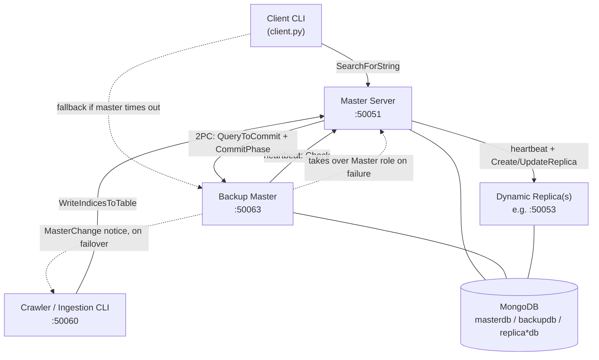
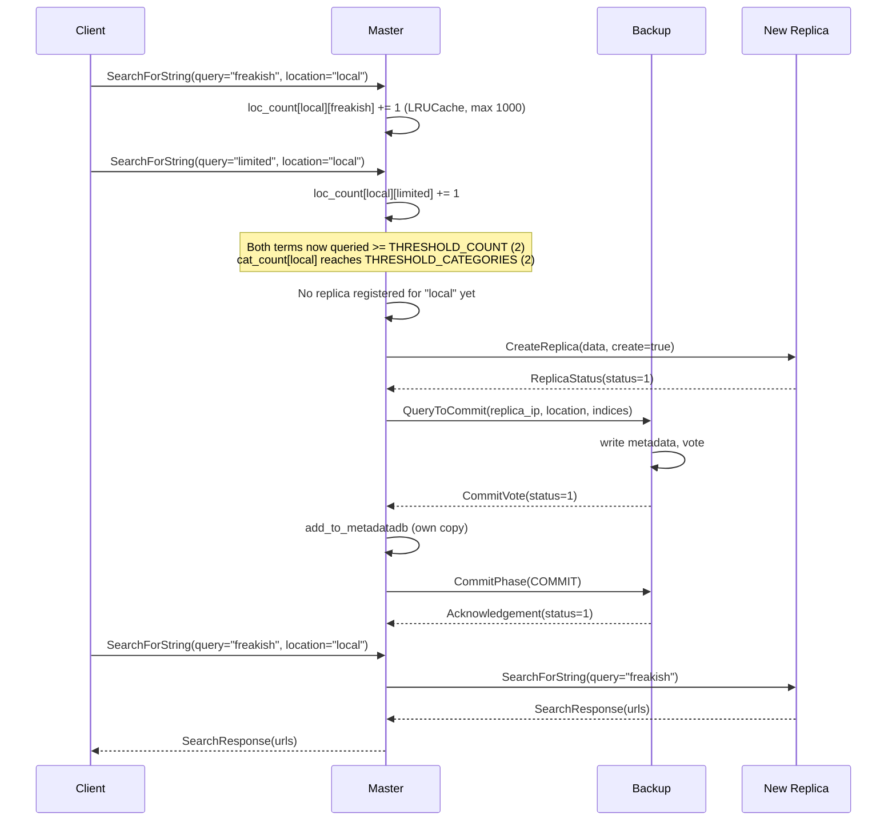
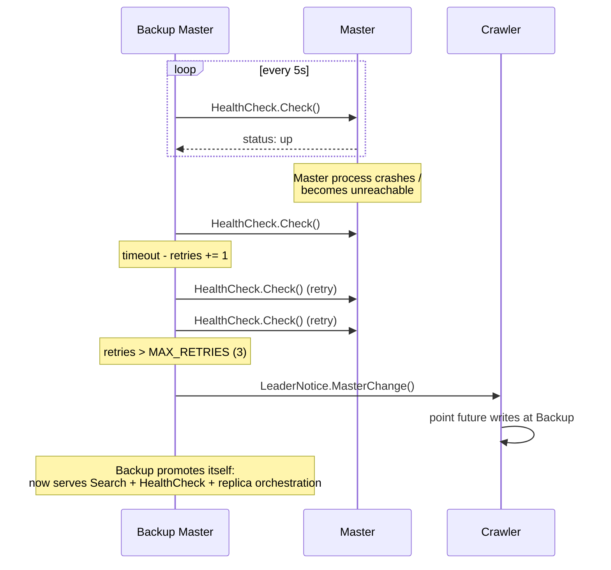

# Distributed Search Engine

**A search engine that watches its own traffic and reshapes itself around it** — provisioning geography-local replicas the moment a topic starts trending somewhere, and quietly retiring them the moment it stops.


*This implementation is a Python 3 port and hardening pass of an existing distributed-systems design — see [Acknowledgments and Project History](#acknowledgments-and-project-history) for the full lineage.*

---

## Table of Contents

- [Overview](#overview)
- [At a Glance](#at-a-glance)
- [Architecture](#architecture)
- [How It Works](#how-it-works)
  - [Dynamic Replica Provisioning](#1-dynamic-replica-provisioning)
  - [Consistency: Two-Phase Commit for Metadata](#2-consistency-two-phase-commit-for-metadata)
  - [Failure Handling: Heartbeats, Eviction, and Failover](#3-failure-handling-heartbeats-eviction-and-failover)
- [RPC Surface](#rpc-surface)
- [Repository Structure](#repository-structure)
- [Getting Started](#getting-started)
  - [Prerequisites](#prerequisites)
  - [Quick Start with Docker Compose](#quick-start-with-docker-compose)
  - [Manual Setup](#manual-setup)
  - [Configuration](#configuration)
  - [Try It Out](#try-it-out)
- [Project Status and Design Notes](#project-status-and-design-notes)
- [Testing](#testing)
- [Roadmap](#roadmap)
- [Contributing](#contributing)
- [Acknowledgments and Project History](#acknowledgments-and-project-history)
- [License](#license)

---

## Overview

This is a master/replica search engine built on gRPC, where the **master server watches its own query traffic in real time**. When a search term is repeatedly queried from the same location, and enough such "hot" terms accumulate for that location, the master automatically provisions a replica there — copying over not just the hot term but its entire synonym cluster — with no human running a migration. When a replica goes quiet, the same heartbeat mechanism that keeps it alive quietly evicts the indices nobody's asking for anymore.

Around that core idea sits a small but real distributed-systems stack: a backup master that heartbeats the primary and promotes itself on failure, a two-phase-commit-style exchange to keep replica metadata consistent between master and backup, and an inverted index served out of MongoDB. Every inter-service call is a gRPC RPC defined in a single `.proto` contract.

It's built to demonstrate — and let you actually run — a handful of distributed systems concepts end to end: dynamic replication, leader failover, bounded caching/eviction, and metadata consistency across two coordinating nodes.

---

## At a Glance

| Layer | Technology |
|---|---|
| Language | Python 3.9+ (developed and tested on 3.12) |
| RPC / Transport | gRPC + Protocol Buffers |
| Storage | MongoDB 4.2+ (via PyMongo 4.x) |
| Containerization | Docker, Docker Compose |
| Configuration | `python-dotenv` (`.env`) |
| Bounded caching | `cachetools.LRUCache` |

---

## Architecture



Solid arrows are the steady-state path; dashed arrows only fire during a failover.

| Component | File | Responsibility |
|---|---|---|
| **Master** | `master.py` | Serves queries directly or by proxy; tracks per-location query popularity; triggers replica creation/updates; coordinates 2PC with the backup; heartbeats every replica |
| **Backup Master** | `masterbackup.py` | Mirrors the master's metadata via 2PC; heartbeats the primary; promotes itself to master and notifies the crawler if the primary stops responding |
| **Replica** | `replica.py` | Serves a geographically local slice of the index; tracks per-word idle time; reports and evicts stale words on every heartbeat |
| **Crawler** | `crawler.py` | Interactive CLI that synthesizes new index entries and pushes them to whichever node is currently master; also the notification target when the backup takes over |
| **Client** | `client.py` | Interactive CLI; queries the master, falling back to the backup on timeout |
| **WriteService** | `writeservice.py` | Shared gRPC servicer mixed into master/backup/replica for writes and 2PC vote/commit handling |
| **MongoDB** | external | One physical instance, logically partitioned per node (`masterdb`, `backupdb`, `<replica-name>db`); each holds an `indices` collection (the inverted index) and, for master/backup, a `metadata` collection (which replica serves which location) |

Master, Backup, and Replica are all instances of the **same** `Master` Python class, parameterized by a `db_name` string (`"master"`, `"backup"`, or a replica's own `--name`). That single class is what decides, at runtime, whether a node tracks query popularity and orchestrates replicas, or just serves its own local slice of the index.

---

## How It Works

### 1. Dynamic Replica Provisioning



The master keeps two LRU-bounded counters (`cachetools.LRUCache`, capped at 1,000 locations each): how many times a term has been queried per location, and which terms at that location have crossed the repeat threshold. Once enough terms are "hot" for a location, the master:

1. Looks up whether a replica already exists there, and whether it already has the needed terms.
2. If not, picks a replica IP for that location from `replicas_list.txt` and sends it the data via `CreateReplica` (or `UpdateReplica`-style `CreateReplica` with `create=false` if the replica exists but is missing terms).
3. When copying a hot term, it also pulls in every other term in that term's synonym cluster (`sim_words`, sourced from `data/synonyms.txt`) — the "similarity matrix" mentioned in the project's original design.
4. Registers the new assignment in its own metadata **and** the backup's, via the two-phase commit described below.
5. From then on, transparently proxies matching queries to the replica instead of answering from its own database.

### 2. Consistency: Two-Phase Commit for Metadata

When a replica is created or extended, the location → replica-IP → indices mapping needs to agree between the master and the backup, so that if the backup is ever promoted, it already knows who's serving what. This is implemented as a prepare/commit exchange modeled on two-phase commit: the master asks the backup to vote via `QueryToCommit`, the backup writes and votes, the master unconditionally applies its own write, and — only if the backup voted to commit — the master sends a final `CommitPhase(COMMIT)` acknowledgement (retried up to 3 times).

Worth calling out precisely, since it's a genuine nuance rather than a bug: the backup's write happens *during* the "prepare" step rather than being staged behind the final commit message, and the protocol's `ROLL_BACK` code is defined but never actually sent anywhere in the code. That makes this a **simplified, best-effort variant of 2PC** — good enough to keep a single demo cluster's metadata in sync across a controlled failover, but not a substitute for a transactional protocol with real rollback semantics.

### 3. Failure Handling: Heartbeats, Eviction, and Failover



Two independent heartbeat loops keep the cluster honest:

- **Master → replica, every 5 seconds:** the master calls each replica's `HealthCheck.Check`. Each replica tracks how many consecutive heartbeats have passed since a given word was last queried; once a word hits `THRESHOLD_IDLETIME` (10) idle heartbeats, the replica evicts it locally and reports it back, so the master can prune the same word from its own popularity counters and metadata. If a heartbeat to a replica fails outright, the master looks up an alternate IP for that location in `replicas_list.txt` and migrates the location's indices there instead.
- **Backup → master, every 5 seconds:** the backup calls the master's own `HealthCheck.Check`. After 3 consecutive failures, the backup notifies the crawler via `LeaderNotice.MasterChange` (so future writes go to the new master) and promotes itself in place, taking over query serving, replica heartbeats, and replica orchestration.

---

## RPC Surface

Every inter-service call is defined in [`protos/search.proto`](protos/search.proto) across six services:

| Service | RPC | Purpose |
|---|---|---|
| `Search` | `SearchForString` | Run a query and return matching URLs (client → master/backup/replica) |
| `DatabaseWrite` | `WriteIndicesToTable` | Ingest new index entries (crawler → master/backup) |
| `DatabaseWrite` | `QueryToCommit` | 2PC prepare + vote for a metadata write (master → backup) |
| `DatabaseWrite` | `CommitPhase` | 2PC commit acknowledgement (master → backup) |
| `HealthCheck` | `Check` | Heartbeat, in both directions (backup → master, master → replica) |
| `LeaderNotice` | `MasterChange` | "I am the new master" notice (backup → crawler) |
| `ReplicaCreation` | `CreateReplica` | Bootstrap a brand-new replica, or extend an existing one |
| `ReplicaUpdate` | `UpdateReplica` | Push incremental, already-committed index updates (master → replica/backup) |

---

## Repository Structure

```text
.
├── protos/
│   └── search.proto           # gRPC service & message definitions — the source of truth
├── data/
│   ├── generatedata.py        # builds synthetic inverted-index docs from synonyms.txt
│   ├── synonyms.txt           # 105 synonym groups, sourced from smart-words.org
│   ├── indices.json           # seed dataset: 681 pre-committed terms, ready for mongoimport
│   └── README.md
├── master.py                  # Master server: query routing, replication trigger, 2PC coordinator
├── masterbackup.py            # Backup master: shadow metadata, heartbeats master, promotes on failure
├── replica.py                 # Dynamic replica server: serves a geo-local slice of the index
├── crawler.py                 # Data-ingestion CLI + failover notification target (not a web crawler)
├── writeservice.py            # Shared gRPC servicer: writes, 2PC vote/commit handlers
├── client.py                  # Interactive query client (targets master, falls back to backup)
├── utils.py                   # Mongo access layer, logging setup, replica-list cache, misc. helpers
├── config.py                  # Centralized, environment-variable-driven configuration
├── search_pb2.py, search_pb2_grpc.py   # Generated from protos/search.proto — see generate_proto.sh
├── generate_proto.sh           # Regenerates the two files above after editing the .proto
├── docker-compose.yml           # mongo + master + backup + replica1, one command
├── Dockerfile                   # Multi-stage build: compiles protos, then a slim runtime image
├── replicas_list.txt             # Static "location -> replica IP" directory for demo routing
├── requirements.txt
├── environment.sh / clean.sh      # Convenience scripts: venv activation / removing logs & .pyc files
├── CONTRIBUTING.md
├── PORTING_NOTES.md               # Python 2 -> 3 migration log: what changed, and why
└── production_readiness_report.md # Self-audit against production engineering standards
```

---

## Getting Started

### Prerequisites

- Python 3.9+ (developed and tested on 3.12)
- MongoDB 4.2+ (PyMongo 4.17+ requires it) — a local install or the bundled Docker service both work
- Docker and Docker Compose, if using the containerized path
- The [MongoDB Database Tools](https://www.mongodb.com/try/download/database-tools) (`mongoimport`), for seeding data, on either path

### Quick Start with Docker Compose

```bash
git clone <this-repo-url>
cd search-engine
docker compose up --build -d
```

This starts four containers: `mongo`, `master` (`:50051`), `backup` (`:50063`), and `replica1` (`:50053`).

Seed the two databases the master and backup read from (`data/indices.json` ships 681 pre-committed terms):

```bash
mongoimport --uri "mongodb://localhost:27017/masterdb" --collection indices --jsonArray --file data/indices.json
mongoimport --uri "mongodb://localhost:27017/backupdb" --collection indices --jsonArray --file data/indices.json
```

Run the interactive client against the running cluster:

```bash
docker compose run --rm master python client.py --master master:50051 --backup backup:50063
```

Optionally, push a brand-new term into the live cluster with the ingestion CLI:

```bash
docker compose run --rm master python crawler.py --master master:50051 --backup backup:50063
```

### Manual Setup

```bash
git clone <this-repo-url>
cd search-engine
python3 -m venv venv
source venv/bin/activate      # environment.sh does this, plus unsets any proxy vars
pip install -r requirements.txt
```

Generate the gRPC/protobuf bindings (already included in this snapshot — regenerate only if you edit `protos/search.proto`):

```bash
bash generate_proto.sh
```

Install and start MongoDB 4.2+ locally, then seed it:

```bash
mongoimport --jsonArray -d masterdb -c indices data/indices.json
mongoimport --jsonArray -d backupdb -c indices data/indices.json
```

List your replica servers in `replicas_list.txt` (format: `IP:PORT LOCATION`, one per line). The repo ships one demo line:

```text
localhost:50053 local
```

Copy `.env.example` to `.env` and adjust it if your hosts/ports differ from the defaults, then start each component in its own terminal:

```bash
python master.py --ip localhost:50051 --backup localhost:50063
python masterbackup.py --ip localhost:50063 --master localhost:50051 --crawler localhost:50060
python replica.py --ip localhost:50053 --port 50053 --name replica1
python crawler.py --master localhost:50051 --backup localhost:50063
python client.py --master localhost:50051 --backup localhost:50063
```

### Configuration

All addresses and connection strings are environment-driven via `config.py` / `.env`:

| Variable | Default | Read by |
|---|---|---|
| `MONGO_URI` | `mongodb://localhost:27017/` | every component, via `utils.py` |
| `MASTER_IP` | `localhost:50051` | default `--master` target for `masterbackup.py`, `crawler.py`, `client.py` |
| `BACKUP_IP` | `localhost:50063` | default `--backup` target for `crawler.py`, `client.py` |
| `CRAWLER_IP` | `localhost:50060` | default `--crawler` target for `masterbackup.py` (used to notify on failover) |
| `REPLICAS_LIST_FILE` | `replicas_list.txt` | `master.py` / `masterbackup.py` / `replica.py`, via `utils.read_replica_filelist()` |

`master.py`'s own `--ip`/`--backup` and `replica.py`'s `--ip`/`--port`/`--name` are **required** flags with no config fallback — by design, since "what is my own address or name" can't have a meaningful shared default.

### Try It Out

With the cluster running and `masterdb`/`backupdb` seeded, reproduce the dynamic-replication path end to end:

```text
$ python client.py --master localhost:50051 --backup localhost:50063
Type your query : freakish
Type your location: local
Type your query : freakish
Type your location: local
Type your query : limited
Type your location: local
Type your query : limited
Type your location: local
```

After the fourth query, `freakish` and `limited` have each been searched twice from `local` — enough to cross both thresholds. Watch the master's terminal: you'll see `Setting up the replica in local at localhost:50053`, followed by the 2PC exchange with the backup. Every `local` query after that point is transparently served by `replica1` instead of the master's own database.

---

## Project Status and Design Notes

This project has already been through one audit-and-fix cycle. [`production_readiness_report.md`](production_readiness_report.md) is a point-in-time review that flagged several critical and high-severity issues in the freshly-ported codebase. Most of those have since been fixed directly in this repository — what follows reflects the **current** code, not the report's original conclusions.

**Fixed since the audit:**
- MongoDB connection pooling — a single pooled client (`maxPoolSize=100`), not one connection per query
- Bounded, LRU-evicting popularity counters (`cachetools.LRUCache`, capped at 1,000 locations) instead of unbounded dicts
- Replica-list parsing is now cached in memory and only re-parsed when the file's modification time changes
- Every unary gRPC call carries an explicit timeout
- Infrastructure addresses/URIs are environment-configurable (`config.py` + `.env`) rather than hardcoded
- `Dockerfile` + `docker-compose.yml` for one-command local clusters
- `threading.Thread`/`threading.Event` plus real `SIGTERM`/`SIGINT` handlers for graceful shutdown
- Logs stream to stdout (container-friendly) and rotate on disk (10 MB × 5 backups) instead of growing forever

**Still open:**
- **No transport security.** Every gRPC channel is `grpc.insecure_channel`, and MongoDB has no authentication configured. Fine for a local demo; not something to point at an untrusted network as-is.
- **No automated tests or CI.** Correctness has been verified by manual end-to-end runs and static compilation checks, not a test suite — see [Testing](#testing).
- **Simplified two-phase commit.** See [Consistency](#2-consistency-two-phase-commit-for-metadata) above — no rollback path is actually exercised.
- **The "crawler" doesn't crawl.** It's a synthetic data generator/ingestion CLI, not something that fetches and parses live web pages.
- **Single-region demo topology.** `docker-compose.yml` wires up one replica in one location (`local`); multi-region behavior (a client in `"india"` vs. `"usa"` landing on different replicas) has to be demonstrated by hand-editing `replicas_list.txt` and launching more `replica.py` processes.
- **Location is client-declared, not geo-resolved.** "Geography-aware" means the client tells you where it is, not that the system performs IP geolocation.

---

## Testing

There is no automated test suite yet. Confidence in the current codebase comes from manual end-to-end runs of the full master → backup → replica → crawler → client chain (captured examples are in `log*.log` at the repo root), and from `python -m py_compile` validation of every module during the Python 2 → 3 port (see `PORTING_NOTES.md`). If you're picking a first contribution, `pytest` coverage for `utils.py`'s database layer and for the replication-trigger logic in `master.SearchForString` would be the highest-leverage place to start.

---

## Roadmap

- [ ] TLS for all gRPC channels, and MongoDB authentication
- [ ] Automated test suite and a CI pipeline
- [ ] `.gitignore` for `__pycache__/`, `*.pyc`, `*.log`, `.env`, `venv/` (currently only `.dockerignore` exists)
- [ ] Kubernetes manifests / a Helm chart (Compose currently covers single-host only)
- [ ] Redis (or similar) for popularity counters, so multiple master-facing nodes could share state
- [ ] Prometheus metrics and a health-check endpoint
- [ ] Raft-based (or similar) leader election instead of one fixed backup
- [ ] Smarter replica placement — currently the first IP listed per location in `replicas_list.txt`
- [ ] A real crawler (fetch + parse live pages) behind the existing ingestion RPC contract

---

## Contributing

See [`CONTRIBUTING.md`](CONTRIBUTING.md) for setup details. In short: abstract hardcoded values into sysargs or config, keep all inter-service communication as gRPC calls defined in `protos/search.proto`, and avoid device-specific parameters baked into the code.

---

## Acknowledgments and Project History

The core architecture in this repository — a master/backup topology with popularity-triggered dynamic replication, similarity-based index expansion, and sequentially consistent replica metadata — originates from [zorroblue/distributed-search-engine](https://github.com/zorroblue/distributed-search-engine), a project that creates location-specific replicas on the fly when a topic is repeatedly searched from one region, backed by a standby master for fault tolerance and sequentially consistent metadata between the two.

This repository builds on that design with:

- A complete Python 2 → Python 3 port, documented in [`PORTING_NOTES.md`](PORTING_NOTES.md), including fixes for several bugs that only surfaced at runtime — not at parse time — from Python 3's stricter iteration and I/O semantics.
- A self-conducted production-readiness audit, [`production_readiness_report.md`](production_readiness_report.md), evaluating the ported codebase against production engineering standards.
- A hardening pass addressing most of that audit's critical and high-severity findings — see [Project Status and Design Notes](#project-status-and-design-notes) for exactly what's fixed and what remains open.

Synonym data in `data/synonyms.txt` is sourced from smart-words.org (see `data/README.md`).

---

## License

No `LICENSE` file is currently included in this repository, so by default all rights are reserved to the author. If you intend to share this project publicly, consider adding an OSI-approved license — MIT and Apache-2.0 are common choices for projects like this. The upstream project this was ported from does not carry a license file either, so treat its design as a reference rather than as license-cleared code.